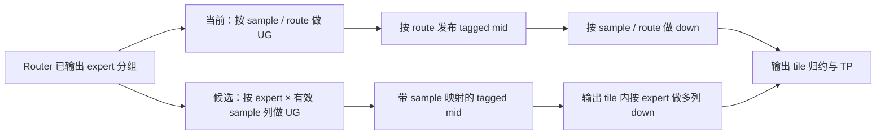

# Kimi MTP3：从计算数据流与 HBM 复用重新选择方向

2026-09-28。接续 [八个局部候选实验](kimi_mtp_att_followup_zh.md)，本轮按用户提出的“从计算原理改变 pipeline 流动、减少 HBM 反复 load，并核对 GLM compact 设计”重新审计数据流，并增加三 seed 的硬件内存计数器采集。

**当前 fused routed pipeline 的 HBM 读请求比 staged routed GEMM1+GEMM2 多约 23%，L2 读请求量约为其 1.77–2.04 倍。** 代码上一个关键差异是：staged 两级 GEMM 都利用 expert 分组，当前 pipeline 按 sample/route 处理，没有让两级计算共同复用同专家权重。因此，下一项结构性候选应优先保留 expert 分组贯穿 UG 和 down，再处理 intermediate 的局部驻留；不再优先微调 sleep、activation staging 或扩大 CTA。

本报告记录的是源码、数学依赖、逻辑字节预算和六次 TP8 PMC 审计。后续已完成 [双阶段 expert compact 实现、九个候选、ATT 与三 seed 复测](kimi_mtp_expertcompact_zh.md)：HBM 读请求降低约 17.4–18.2%，但最快候选仍比原 pipeline 慢约 2 μs，未接入工作区 kernel。

## 1. 三 seed 的硬件证据

环境仍为 node47 / MI355X gfx950 / Podman `ziming_huang_work`。同一 true-MTP3 S4、TP8、staged KDA 完整层应用，分别使用原 768/P544 pipeline 和 staged 路径；全部运行包含原有 `--check` 和 graph replay 重查。pipeline 重新执行 compile-only 与实际 HIP occupancy，768 配置仍为 3 CTA/CU。代码没有 soft 插桩，也没有 ATT。

使用 rocprofv3 PMC，同组采集已通过 `rocprofv3-avail pmc-check`：

- `TCC_EA0_RDREQ_DRAM_32B_sum × 32`：TCC/EA 发往 DRAM 的读请求字节。该计数器把 64/128-byte 请求分别计为 2/4 个 32-byte sector。
- `TCC_READ_SECTORS_sum × 32`：进入 TCC/L2 的读请求字节，包括最终命中缓存的请求。
- `TCC_HIT_sum` / `TCC_MISS_sum`：TCC lookup 统计，原始值随证据保留，不把它们直接解释为所有 read 的命中率。

每个目标 kernel 采集第 65 次匹配 dispatch（iteration `[64]`）。每 seed 有 8 个 GPU 样本；staged 先在同一个进程/GPU 内将 GEMM1 与 GEMM2 的计数相加，再对 8 个 GPU 取中位数。seed1234 顺序为 pipeline→staged，seed2025 反转，seed42 再用 pipeline→staged。seed1234 的 staged 探测曾收集其他 kernel，分析只选择两个目标 routed GEMM，后两 seed 直接限制为这两个 kernel。

| seed | 独立 expert 数 | pipeline HBM 读请求，MiB/卡 | staged GEMM1+2，MiB/卡 | 多出的 MiB | pipeline / staged |
|---|---:|---:|---:|---:|---:|
| 1234 | 48 | 125.802 | 102.238 | 23.564 | 1.230 |
| 2025 | 47 | 122.832 | 100.172 | 22.660 | 1.226 |
| 42 | 47 | 123.836 | 100.173 | 23.663 | 1.236 |

| seed | pipeline L2 读请求，MiB/卡 | staged GEMM1+2，MiB/卡 | pipeline / staged |
|---|---:|---:|---:|
| 1234 | 203.378 | 115.069 | 1.767 |
| 2025 | 226.596 | 111.238 | 2.037 |
| 42 | 212.893 | 111.344 | 1.912 |

图：[内存请求对照 PNG](../../results/kimi_mtp_dataflow_20260928/node47/memory_comparison.png) / [SVG](../../results/kimi_mtp_dataflow_20260928/node47/memory_comparison.svg)。误差线表示八个 GPU 的最小/最大值，不是置信区间。

seed1234 的八卡 HBM 范围为 pipeline 125.401–126.322 MiB、staged 102.238 MiB；其他 seed 的范围见 [memory_summary.json](../../results/kimi_mtp_dataflow_20260928/node47/memory_summary.json)。这不是由一个异常 GPU 造成的差距。

比较边界需要保留：pipeline 包含 routed TP，staged 的表格仅包含两个 routed GEMM；两者的 tiling、格式布局、cache 行为和临时缓冲也不同。因此，计数器证明的是**存在额外内存请求**，并不能把全部 23 MiB 因果归给某一处代码。两者都未包含表格之外的 router/shared/latent/attention。PMC 可能改变调度与缓存状态，其时间戳和应用 event 时间都不用于新的性能结论。MiB 为 2²⁰ bytes。

## 2. 先看算式与必须保留的依赖

对 sample `s` 和它选择的 expert `e`，忽略符号中的量化 scale 展开：

```text
mid[s,e] = BF16(SiTU(UG[e] × x[s]))
y[s]     = sum_e probability[s,e] × (Down[e] × mid[s,e])
```

SiTU 是非线性的，不能将 `Down[e] × UG[e]` 预先合并成一个线性矩阵；一个 intermediate 元素要先完成 hidden=3584 上的 UG 归约，才能进入 SiTU 和 down。BF16 intermediate 的舍入位置与 route weighting 的数学语义也必须保留。

可以改变的是任务所有权和复用维度：同 expert 的多个 sample 共用权重；一个 ready intermediate tile 可以供多个输出行使用；输出部分和可以在 CTA 内、LDS 或全局缓冲中按确定次序归约。不同选择会交换权重重复读取、intermediate 读写、输出部分和流量以及并行度。

当前实现与首选候选的区别：



候选仍按输出 tile 决定 TP 所有权。改变的是两级 MFMA 都消费 expert 分组，每份权重片段供该 expert 的全部有效 sample 列使用；没有要求先引入全局任务队列或 atomic scatter。

## 3. 逻辑字节预算：主要权重比 activation 大得多

S4 有 64 条 route。每 expert 的 UG 为 `2×384×3584`，down 为 `3584×384`；MXFP4 每元素 0.5 byte，E8M0 scale 每 32 元素 1 byte。

| 计算组织 | UG 权重与 scale，MiB/卡 | down 权重与 scale，MiB/卡 | 合计 |
|---|---:|---:|---:|
| 每条 route 一次，共 64 次 | 89.250 | 44.625 | **133.875** |
| 每独立 expert 一次，共 48 次 | 66.938 | 33.469 | **100.406** |
| 每独立 expert 一次，共 47 次 | 65.543 | 32.771 | **98.314** |

这些是包含 scale 的逻辑字节量，未计 cache、tag、重试、对齐或重复指令，不是 PMC 测量。64→48 的理论权重读取削减为 25%；测得 HBM 差距约 23 MiB/卡，与“pipeline 的一部分重复读已被缓存吸收”相容，但不能据此断言确切 cache 归因。

相较之下，S4 的唯一 BF16 activation 仅 **28 KiB**。当前 768 个 U32 task 每次重载一个 sample，逻辑 staging 总量为 **5.25 MiB**，且这些数据可能大量命中缓存。这解释了为何上一轮省 activation staging 没有自动带来明显收益：它没有触及 100 MiB 量级的权重主数据流。

intermediate 的唯一 BF16 payload 为 **48 KiB**，带 epoch 后是 **96 KiB**。224 个 D16 consumer 每个消费全部 route 的 intermediate，即使不算重试和末轮无用预取，逻辑 tagged read 也有 **21 MiB**。这里是 L2/请求次数层面的放大；不能把 21 MiB 全都称为真实 HBM 读取。

完整可重算预算：[dataflow_model.py](../../results/kimi_mtp_dataflow_20260928/dataflow_model.py) / [JSON](../../results/kimi_mtp_dataflow_20260928/dataflow_model.json)。

## 4. GLM 当前 one-kernel 的 compact 具体做了什么

核对的是当前活跃的 `S > 1` 路径；后面的旧 `ug_split(S)` 分支不解释本次 S4 行为。

| GLM 机制 | 当前源码 | 实际作用与迁移边界 |
|---|---|---|
| UG8：8 gate + 8 up 合成 16-row group | `glm5_monokernel/kernel.py:2006` | 紧凑使用 MFMA 行，避免旧调度的 K 分段部分和 mailbox；不是将全部 intermediate 留在寄存器 |
| 一次 stage 所有 sample 的 activation | `kernel.py:2096` | 多个任务复用 LDS activation；GLM 此处是 FP8-rounded activation，Kimi 必须保留 BF16 语义 |
| shared expert 的权重服务所有 sample 列 | `kernel.py:2010`、`kernel.py:2027` | 同权重多列 MFMA，是实质的跨 sample 权重复用 |
| routed expert 预取下一 sample 的权重 | `kernel.py:2103` | 隐藏 load 延迟，但仍逐 sample 加载；未见 routed expert 去重贯穿 UG/down 的实现 |
| metadata 保存在 LDS 并跨 UG/down 使用 | `kernel.py:2092`、`kernel.py:2281` | 减少 expert ID/系数重复获取与 descriptor 构造 |
| 按阶段生命周期复用 LDS arena，缩小 output 区 | `kernel.py:201`、`kernel.py:217` | 减少同时分配的 LDS 总量，影响 residency；本身不代表消除了 HBM mailbox |
| down 将 mid 一次载入 LDS，按输出 tile 做 TP | `kernel.py:2340`、`kernel.py:2374` | 全局 mid 仍存在，每个 down CTA 仍读取依赖；输出归约无需全局 route atomic |

因此回答是：**GLM 有紧凑 tile、LDS 生命周期复用和 shared 权重复用，但没有本轮建议的“routed expert 分组贯穿两级”的完整设计，也没有消除 UG→down 的全局 mailbox。** 之前 ATT 已证明它的跨 sample 预取实际存在；S4 down MFMA 仍等待所有 mid 就绪，详见 [GLM/ Kimi ATT 报告](glm_kimi_pipeline_att_zh.md)。

不能照搬 GLM 的 UG8/K 分工：GLM hidden=6144，有 48 个 K128 chunk，可以被 8 waves 均分；Kimi hidden=3584 只有 28 个，不能均分。直接换成 U8 还会把 Kimi 的 UG tile 数从 768 增为 3072，必须连同 sample 批次、K 分工和 activation 驻留一起重新设计。

## 5. 为什么首选“两级共同按 expert 分组”

Kimi router 已经产生 `sorted_expert_ids`、`sorted_token_ids`、`num_valid_ids`，无需另加 CPU 路由或排序。staged 的 [moe.py](../kernels/kimi_k3_monokernel/moe.py) 将这些信息同时交给 GEMM1/GEMM2；当前 [staged.py](../kernels/kimi_k3_monokernel/staged.py) 调用 pipeline 时只传原始 top-k ID/weight，pipeline 丢掉了这个跨 token 复用机会。

具体候选可以保持输出所有权：

1. 从现有 sorted contract 构造小型 `expert → 有效 sample/route` 映射；S4 中一个 expert 最多有四个有效 sample，padding 列不参与输出。
2. UG 的权重/scale fragment 只加载一次，在 MFMA 的不同列计算该 expert 的有效 sample；SiTU 后仍发布携带 epoch 的 BF16 payload。
3. down 的输出 owner 遍历 expert 分组，一个 `Down[e, row16, K128]` fragment 同时计算该 expert 的有效 sample 列，避免每条 route 重读权重。route coefficient 与 sample 映射在 CTA 内使用。
4. 输出 owner 在 FP32 中合并贡献，再按约定 BF16 边界进入现有确定的 routed TP/tail。任何专家遍历次序变化都必须重新验证独立参考、数值误差和 TP/tail 精确关系。

这与先前的 `grouped_up` 不同。之前仅 UG 使用排序结果，down 仍按 route；还会每个 UG task 重建多 sample activation staging。它在完整输入下没有获益（旧 512-grid MoE 筛选为 81.353 μs），不能作为新候选已通过或已失败的证据；也不能把相同实现重新命名后重测。新候选必须同时减少 UG **和 down** 的权重请求，并避免重新引入 staging 成本。

第一版保持全局 tagged mid，先隔离权重复用的效果。这样可以用已有正确性参考和输出所有权验证设计，并用相同 PMC 查看读请求是否向 staged 靠近，再用关闭 PMC/ATT/soft 的三 seed 完整层 GPU events 判断收益。节省字节数并不等于同比例节省时间。

## 6. “UG 后立即 down、mid 完全留 LDS”的实际代价

这条数据流在计算上成立：一个 CTA 完成某 expert 的 intermediate 行块，SiTU 后立即消费该行块的 down 权重，产生全部输出行的部分和。但没有免费的分工：一个 CTA 处理完整 expert 只有 47–48 个有效 task，难以利用整卡；把 intermediate 拆细增加并行度，会产生跨 CTA 输出部分和。

以下按 48 个独立 expert、64 条有效 route，以及 FP32 部分和携带 32-bit tag、写入和读取各一次估算。这里只计算部分和 mailbox，不含权重和最终 TP：

| 每任务 intermediate 行数 | expert 分组后的 task 数 | FP32 部分和 payload，单向 MiB | tagged 部分和写+读，MiB |
|---|---:|---:|---:|
| 32 | 576 | 10.500 | **42.000** |
| 64 | 288 | 5.250 | **21.000** |
| 128 | 144 | 2.625 | 10.500 |
| 384（完整 expert） | 48 | 0.875 | 3.500 |

当前 intermediate 正常 tagged read 的逻辑预算是 21 MiB，额外还存在 retry。因此直接在 U32 粒度把 mid 改成输出部分和，可能增大 mailbox 流量；U64 有更合适的并行度，但要额外承担确定性归约和更长的每任务生命周期。换成独立 ready flag、压缩 tag 或改变部分和精度会改变同步/数值协议，需要单独论证。

所以“全留 LDS”保留为第二阶段候选，不能先承诺它一定比全局小型 mid 更快。首选两级 expert 分组更直接作用于已测得的权重流量差距，同时保留现有按输出 tile 的 TP 结构。

## 证据与当前状态

结果目录：[kimi_mtp_dataflow_20260928/node47](../../results/kimi_mtp_dataflow_20260928/node47/)。包含六次 PMC 运行的 profiler 配置、逐进程原始 counter/kernel/agent CSV、命令和 rc、完整 TP8 正确性 JSON、source snapshot、编译资源、计数器官方描述及分析脚本。全部六次 TP8 检查通过，8 卡均有目标计数。

重算内存表：

```bash
python3 analyze_memory.py node47 --validator node47/previous_validation.py
python3 dataflow_model.py
```

前一轮四份 ATT 与八个候选的归档也已完成：7,223 个文件 SHA256 校验通过，39 次 TP8、8 次 TP1 独立参考/改变 payload replay、352 个 ATT wave 完整 stitched。两轮证据分别保存，PMC 应用耗时不混入前一轮无插桩性能表。

这次审计将优先级从局部调度微调改为**两级 expert 分组与多 sample 列复用**。其后续实现与负收益证据见 [expert compact 报告](kimi_mtp_expertcompact_zh.md)；当前仍以 staged 作为实测更快的路径，没有提交或推送。
