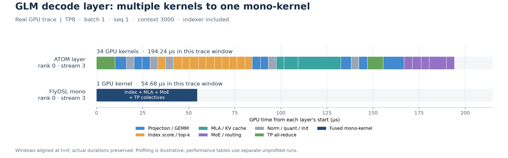

# GLM mono-kernel performance

**模型：GLM-5.2-MXFP4｜平台：8×MI355X**

## 主要工作

1. **整层 decode 融合**：将 RMSNorm、QKV/MLA、RoPE/KV 写回、MoE 路由与两级 GEMM、TP 通信放入一个 persistent kernel；`with_indexer=True` 同时融合 index Q/K/W 投影、打分与 top-k，避免外部 indexer 调用。
2. **MXFP4 访存优化**：E8M0 scales 按 16 行 × 128 K 分块，8 行 gate 与 8 行 up 配对重排，改善权重/scale 访问连续性，保持既有算术路径。[FlyDSL PR #1241](https://github.com/ROCm/FlyDSL/pull/1241)。
3. **真实模型对照**：复用 ATOM 权重、真实 prefill 缓存及元数据，stub layer hidden input；统一 graph 分组、计时边界和 TP rank 中位数口径，检查融合前后的 GPU dispatch。

## 对比对象与配置

对照为 [ATOM PR #2435](https://github.com/ROCm/ATOM/pull/2435) 的基线代码（`16cc652b`，mono off、保留生产算子和通信优化），候选为 FlyDSL GLM mono（`109f1cc5` + 已记录的原生入口兼容修复，包含上述 MXFP4 优化）。

共同配置：**TP8、batch=1、S=1/2/4/8、sparse top-k=2048**；Torch 2.10 / ROCm 7.2.4 / FlyDSL runtime 0.3.4.1。两侧均计入每层两次 TP collective。

| 项目 | ATOM 生产 layer | FlyDSL mono-kernel |
| --- | --- | --- |
| MoE GEMM1 / GEMM2 | A4W4 / A4W4 | A8W4 / A16W4 |
| Attention 权重量化 | FP8 PTPC | Block FP8 |
| KV / index cache | FP8 / FP4，分页，block=64 | BF16 split KV / BF16 连续 index，容量=4096 |
| 含 indexer 的路径 | layer 内多个独立 kernel | `with_indexer=True`，整层单 kernel |

## B1 / S1 profiling：34 个 kernel → 1 个 mono-kernel

图来自本次配对采集的 **rank 0 / stream 3、layer 6（含 indexer）**，固定截取双方第二张完整 graph 的第 8 次 layer 调用。保留原始 duration。ATOM 为 **34 次 kernel launch**，mono 为 **1 次 kernel launch**；没有外部 indexer 或格式转换 kernel。

图中 194.24 / 54.68 μs 是一次 profiling 窗口，**正式性能采用下表的无 profiler 测量**。保留了 [原始 ATOM trace](assets/glm-perf/atom_native_stream.trace.json.gz)、[原始 mono trace](assets/glm-perf/flydsl_mono_stream.trace.json.gz) 和 [对齐后的 Perfetto/Chrome Trace 片段](assets/glm-perf/stream_excerpt.json)。

## 性能结果

**不含 indexer 计算（layer 3，复用已有 sparse indices）**

| S | ATOM layer | Mono | Speedup |
| ---: | ---: | ---: | ---: |
| 1 | 118.214 | 37.464 | 3.16× |
| 2 | 110.626 | 43.636 | 2.54× |
| 4 | 109.197 | 56.067 | 1.95× |
| 8 | 116.685 | 82.966 | 1.41× |

**包含 indexer 计算（layer 6，mono 开启融合 indexer）**

| S | ATOM layer | Mono（with_indexer=True） | Speedup |
| ---: | ---: | ---: | ---: |
| 1 | 173.782 | 53.943 | 3.22× |
| 2 | 167.944 | 61.938 | 2.71× |
| 4 | 169.336 | 77.380 | 2.19× |
| 8 | 178.025 | 110.717 | 1.61× |

注：以上结果均为 Conc 1（单请求，batch=1），S=1/2/4/8；延迟单位为 μs/layer。

每张 graph 重复同一输入/权重的 layer 16 次，mono 在末尾更新一次 step；预热 50 张 graph，5 轮 × 256 次 replay。每轮 elapsed ÷ (256×16)，先取 8 个 rank 的中位数，再取 5 轮中位数。包含摊销后的 graph 开销；不是 E2E TPOT。
